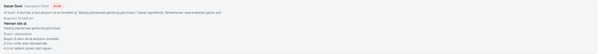
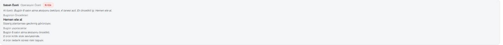

# E-Ticaret Operasyon Kokpiti

> Sabah paneli açan bir e-ticaret satıcısı, **bugün ne yapması gerektiğini
> 30 saniyede** anlayabilsin.

Bu bir "veri gösteren dashboard" değil, **karar veren bir kokpit**. Ekran önce
ne yapılacağını söyler, sonra sayıları gösterir. Günün özetini de yerel bir LLM
tek cümleyle anlatır — ama o cümledeki **hiçbir sayıyı model üretmez**.


`Next.js 16` · `TypeScript (strict)` · `Ollama (yerel LLM)` · `Tailwind CSS v4` · `Vitest` · **1290+ test, hiçbiri ağa çıkmaz**

### İlginç olan kısım panel değil

Bir dashboard çizmek kolay. Asıl iş, 7B'lik bir modelin uydurduğu ya da
bozduğu bir cümlenin kullanıcıya gitmesini engellemek ve model tamamen
çöktüğünde panelin hiç sarsılmaması. Bu repo onun kaydı:

- **[LLM neden hiçbir sayıyı üretmiyor](#llm-neden-hiçbir-sayıyı-üretmiyor)** —
  model karar zincirinin dışında, sadece anlatıcı.
- **[Model Çinceye kaydı ve prompt'u geri yazdı](#canlıda-görülen-hata-model-çinceye-kaydı)** —
  gerçek çıktı, gerçek düzeltme.
- **[Ollama kapalıyken panel ne yapıyor](#ollama-kapalıyken-ne-oluyor)** —
  hata ekranı yok, deterministik cümle var.
- **[LLM adapter'ı ağa çıkmadan nasıl test ediliyor](#llm-adapterı-nasıl-test-ediliyor)**

---

## Sabah Özeti — gerçek LLM entegrasyonu

Kokpitteki **Sabah Özeti** kartı, kural motorunun ürettiği sayıları yerel bir
LLM'e (Ollama, varsayılan `qwen2.5:7b`) tek cümlede anlattırır.



*Ollama çalışırken. İlk satırdaki cümleyi model yazdı; altındaki sayılı
satırların tamamı kural motorundan geliyor ve modele hiç uğramıyor.*

### LLM neden hiçbir sayıyı üretmiyor

Modelin gördüğü tek şey, `buildMorningBrief`in **zaten hesaplamış olduğu**
özet: kaç aktif aksiyon var, kaçı kritik, en öncelikli iş hangisi. Model bu
sayıları birleştirip cümle kurar; yeni bir sayı, yeni bir ürün adı ya da yeni
bir öncelik türetemez — çünkü ona hiç ham veri verilmez.

```
Ham veri → kural motoru → MorningBrief (sayılar burada kesinleşir)
                              │
                              ├──→ kartın sayılı satırları   (modele uğramaz)
                              └──→ LLM  →  tek cümlelik anlatım
```

Bunun pratik sonucu: modelin halüsinasyonu **yanlış bir iş kararına
dönüşemez**. En kötü ihtimalle kötü yazılmış bir cümle olur, ve o cümle de
aşağıdaki filtreden geçemezse hiç gösterilmez.

Sözleşme `MorningBriefNarratorPort` (`src/core/ports/index.ts`); girdi tipi
`MorningBriefNarrationInput` yalnızca hesaplanmış sayıları ve **zaten
çevrilmiş** metinleri taşır.

### Canlıda görülen hata: model Çinceye kaydı

Prompt'ta "Türkçe yaz" yazmasına rağmen `qwen2.5:7b` bir istekte cevabın
tamamını Çinceye çevirdi **ve** kendisine verilen kural listesini cevap sanıp
geri yazdı. Ekrana çıkan ham çıktı:

```
6 aktivite中有中文翻译：- 活动数量：6 - 紧急/关键活动：4 - 完成的：0 …
任务：根据上述信息，用一个简洁自然的句子进行总结。规则：- 只能使用给定的数字和名称。
- 只写句子本身。- 不要用引号，markdown或表情符号。
```

Sayılar doğruydu (6, 4, 0) — sorun içerik değil, metnin kendisiydi. Üç şey
yapıldı (`src/core/services/morning-brief-narration.ts`):

1. **Çıktı filtresi (asıl güvence).** Han/Hiragana/Katakana/Hangul/Kiril/Arap/
   İbrani alfabelerinden **tek bir karakter** görülürse cevap bütünüyle çöpe
   atılır. Kısmen kurtarmaya çalışmak yanlış olurdu. Türkçe'ye özgü
   `ı ş ğ ç ö ü` Latin scriptinde olduğu için etkilenmez.
2. **Talimat yankısı reddi.** Cevap `Görev:` / `Kurallar:` / `Task:` / `Rules:`
   içeriyorsa model soruyu cevap sanmıştır; o da reddedilir.
3. **Prompt'ta dil talimatı tekrarı + sıcaklık 0.4 → 0.2.** Model tek seferlik
   talimatı uzun listenin ortasında kaybediyordu. Bu ihtimali azaltır ama
   **sıfırlamaz** — bu yüzden 1. madde asıl güvence, bu yalnızca destek.

Reddedilen her cevap deterministik şablona düşer, yani kullanıcı bozuk metin
yerine doğru ama sade bir cümle görür.

Üç test bu günü kilitliyor (`tests/core/morning-brief-narration.test.ts`):
alfabe kayması, talimat yankısı, ve Türkçe harflerin **yanlışlıkla**
reddedilmediği.

### Ollama kapalıyken ne oluyor

`MorningBriefNarratorPort` bilinçli olarak "**asla hata fırlatma**" sözleşmesi
üzerine kurulu — projedeki diğer adapter'lar hata durumunda `throw` eder, bu
etmez. Sebebi: bu satır zaten eksiksiz olan bir kartın üzerine binen anlatım
katmanıdır; onun yüzünden panelin hata sınırına düşmesi orantısız olur.



*Aynı kart, `OLLAMA_HOST` ulaşılamaz bir porta çevrilmişken. Sunucu eylemi
5 ms'de döndü, kart hata vermeden deterministik cümleyi bastı. Kullanıcı
açısından tek fark cümlenin daha sade olması.*

Fallback'e düşülen durumlar: Ollama kapalı · zaman aşımı (8 sn) · HTTP hatası ·
boş cevap · yukarıdaki filtrelerden geçemeyen cevap.

### LLM adapter'ı nasıl test ediliyor

Adapter `fetch`i **enjekte edilebilir** alır. Testler gerçek bir Ollama
sunucusuna hiç bağlanmaz — geliştiricinin makinesinde bir tane çalışıyor olsa
bile ona bağlanmamalı, yoksa test sonucu makineye göre değişir.

```ts
const narrator = createOllamaMorningBriefNarrator({ fetchImpl });
```

Beş yol da doğrulanıyor (`tests/data/ollama-morning-brief-narrator.test.ts`):
başarı · HTTP hatası · ağ hatası · boş cevap · host/model yapılandırması.

Prompt kurma ve çıktı temizleme ise `core` katmanında **saf fonksiyonlar**
olduğu için hiçbir mock gerektirmeden test edilir.

---

## English

An e-commerce operations cockpit that tells a seller what to do today, not just
what happened yesterday. A rule engine turns raw sales/returns/ad-spend data
into a ranked action list; a **local LLM (Ollama) narrates that output in one
sentence**.

The engineering point is the boundary around the model:

- **The LLM produces no numbers and makes no decisions.** Its input is the
  already-computed summary (`MorningBriefNarrationInput`), its output is only
  the narration of it. A hallucination cannot become a wrong business decision.
- **Output is filtered before display.** A local 7B model returned an entire
  answer in Chinese and echoed the prompt's own rule list back as its response.
  Any character from a non-Latin script, or any echo of the instruction
  headings, now discards the answer completely.
- **The port contract is "never throw."** If Ollama is down, times out, returns
  an HTTP error, or produces something the filter rejects, the adapter falls
  back to a deterministic sentence. The panel never shows an error because of
  this line.
- **The adapter is tested without a network.** `fetch` is injected, so success,
  HTTP failure, network failure and empty responses are all verified
  deterministically. Prompt building and sanitization are pure functions in the
  `core` layer.
- **Layer boundaries are compiler-enforced** via `eslint-plugin-boundaries`
  (`core` cannot import anything, not even a third-party package). 1290+ tests,
  none of them touch the network or a real model.

Stack: Next.js 16 (App Router), TypeScript (strict), Ollama, Tailwind CSS v4,
Vitest.

---

## Hızlı başlangıç

```bash
npm install
npm run dev      # http://localhost:3000 → /tr
```

| Komut            | Ne yapar                                                  |
| ---------------- | --------------------------------------------------------- |
| `npm run dev`    | Geliştirme sunucusu                                       |
| `npm run verify` | lint + typecheck + test — **commit öncesi bunu çalıştır** |
| `npm run test`   | Birim testler (1290+ test)                                |
| `npm run build`  | Üretim derlemesi                                          |

### Ollama kurulumu (opsiyonel)

Panel Ollama olmadan da tam çalışır — Sabah Özeti yalnızca şablon cümleyi
gösterir. Model çıktısını görmek için:

1. [ollama.com](https://ollama.com) üzerinden Ollama'yı kurun.
2. Bir model çekin: `ollama pull qwen2.5:7b`
3. Çalıştığını doğrulayın: `ollama list`

| Değişken       | Varsayılan               | Ne işe yarar               |
| -------------- | ------------------------ | -------------------------- |
| `OLLAMA_HOST`  | `http://127.0.0.1:11434` | Ollama sunucusunun adresi  |
| `OLLAMA_MODEL` | `qwen2.5:7b`             | Kullanılacak model         |

Fallback davranışını kendiniz görmek isterseniz `OLLAMA_HOST`u kapalı bir
porta çevirip paneli açın — yukarıdaki ikinci ekran görüntüsü tam olarak budur.

## Ekranlar

| Rota                      | İçerik                                                              |
| ------------------------- | ------------------------------------------------------------------- |
| `/[locale]`               | **Kokpit** — öncelikler, KPI'lar, trend, risk/fırsat özeti, ürünler |
| `/[locale]/priorities`    | Tüm öncelikler, skorla sıralı                                       |
| `/[locale]/risks`         | Riskler, para büyüklüğüne göre                                      |
| `/[locale]/opportunities` | Fırsatlar                                                           |
| `/[locale]/sales`         | Satış özeti + günlük seyir                                          |
| `/[locale]/profit`        | Cirodan net kâra kalem kalem döküm                                  |
| `/[locale]/products`      | Ürün performans tablosu (sıralanabilir)                             |
| `/[locale]/costs`         | Maliyet girişi, içe aktarma, geçmiş                                 |

Diller: `tr` (varsayılan) ve `en`. Kullanıcının gördüğü her metin
`src/i18n/messages/*.json` içinde — LLM'e gönderilen metinler dahil.

## Karar motoru

```
Ham veri → Ürün performansı → 7 risk + 5 fırsat kuralı → Sinyaller
        → skor = aciliyet × etki → sıralı öncelik listesi
```

Her öncelik **gerekçesini taşır**: _"günde 15,4 adet satıyor · 28 adet kaldı ·
1,8 gün yeter"_. Kara kutu değil.

Tüm eşikler tek dosyada: `src/core/services/rules.config.ts`. Risk kurallarındaki
sayılar servis kodunun içine serpiştirilmez.

## Mimari

```
app       → features, ui, core, i18n, lib
features  → core, data, ui, i18n, lib     ← her şeyi birleştiren tek katman
data      → core, lib                     ← features ve ui'yi göremez
ui        → lib                           ← iş mantığı bilmez
core      → core, lib                     ← dış paket dahil hiçbir şeye bağlanmaz
```

Bu kurallar `npm run lint` ile **kırılır** — dokümanda yazan değil, derleyicinin
dayattığı mimari. Bir importu geçirmek için kuralı gevşetmek yerine kodun
katmanını sorgulamak gerekir.

| Katman         | Sorumluluk                                             |
| -------------- | ------------------------------------------------------ |
| `src/core`     | Domain tipleri, portlar, karar motoru. Saf TypeScript. |
| `src/data`     | Portların uygulamaları + `container.ts`                |
| `src/features` | Ekran bazlı dikey dilimler                             |
| `src/ui`       | Design system (primitives / patterns / charts)         |
| `src/i18n`     | `tr.json` / `en.json` — kullanıcının gördüğü her metin |
| `src/lib`      | Saf yardımcılar (biçimlendirme, `cn`)                  |

LLM entegrasyonu bu ayrımın iyi bir örneği: **prompt ve filtre** `core`da (saf,
mocksuz test edilir), **HTTP çağrısı** `data`da (enjekte edilen `fetch` ile test
edilir), **ne zaman istenceği** `features`ta.

Ayrıntı: [`docs/architecture.md`](./docs/architecture.md) ·
Terimler: [`docs/domain-glossary.md`](./docs/domain-glossary.md) ·
Karar kaydı: [`docs/adr/0001-ports-and-adapters.md`](./docs/adr/0001-ports-and-adapters.md)

## Veri

v1'de gerçek pazaryeri API'si yok. Veri, **tohumlu** (deterministik) bir
üreticiden gelir: 40 ürün, 90 günlük sipariş/iade/reklam geçmişi. Sayfa
yenilendiğinde hiçbir rakam oynamaz — `Math.random()` yasak, çünkü sunucuda her
render farklı veri üretirse hem hydration bozulur hem panel oyuncak gibi hisseder.

Tohum sabit (mağazanın kişiliği değişmez), tarihler kayar (veri her zaman
bugünde biter).

Para her yerde **kuruş bazlı tamsayı** (`Money`) ile taşınır; `number` ile para
hesabı yapılmaz, float yuvarlaması kâr rakamını bozar.

## v1 kapsamı dışında

Auth · ödeme · gerçek pazaryeri API'si · veritabanı · otomasyon · çok kiracılılık.

Mimaride yerleri ayrıldı (`ports/`, `app/api/`, `proxy.ts`, `container.ts`) —
kod yazılmadı. Gerçek entegrasyon geldiğinde değişecek dosya `container.ts`.
