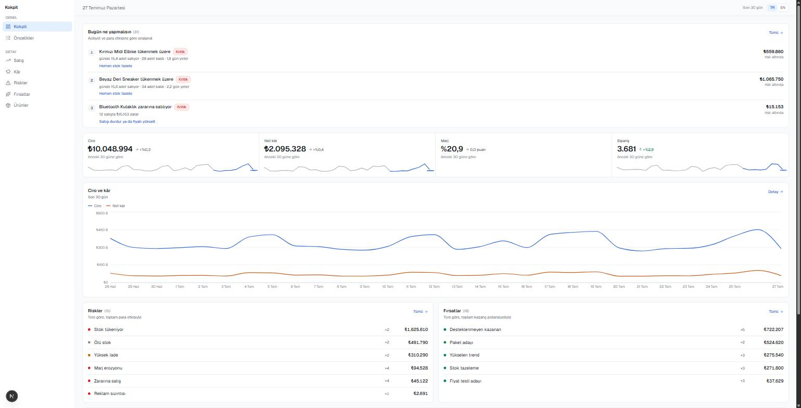

# E-Ticaret Operasyon Kokpiti

> Sabah paneli açan bir e-ticaret satıcısı, **bugün ne yapması gerektiğini
> 30 saniyede** anlayabilsin.

Bu bir "veri gösteren dashboard" değil, **karar veren bir kokpit**. Ekran önce
ne yapılacağını söyler, sonra sayıları gösterir.



## Hızlı başlangıç

```bash
npm install
npm run dev      # http://localhost:3000 → /tr
```

| Komut            | Ne yapar                                                  |
| ---------------- | --------------------------------------------------------- |
| `npm run dev`    | Geliştirme sunucusu                                       |
| `npm run verify` | lint + typecheck + test — **commit öncesi bunu çalıştır** |
| `npm run test`   | Birim testler (109 test)                                  |
| `npm run build`  | Üretim derlemesi                                          |

## Ekranlar

| Rota                      | İçerik                                                              |
| ------------------------- | ------------------------------------------------------------------- |
| `/[locale]`               | **Kokpit** — öncelikler, KPI'lar, trend, risk/fırsat özeti, ürünler |
| `/[locale]/priorities`    | Tüm öncelikler, skorla sıralı                                       |
| `/[locale]/risks`         | Riskler, para büyüklüğüne göre                                      |
| `/[locale]/opportunities` | Fırsatlar                                                           |
| `/[locale]/sales`         | Satış özeti + günlük seyir                                          |
| `/[locale]/profit`        | Cirodan net kâra kalem kalem döküm                                  |
| `/[locale]/products`      | Ürün performans tablosu (sıralanabilir)                             |

Diller: `tr` (varsayılan) ve `en`.

## Mimari — kısa özet

```
app       → features, ui, core, i18n, lib
features  → core, data, ui, i18n, lib     ← her şeyi birleştiren tek katman
data      → core, lib                     ← features ve ui'yi göremez
ui        → lib                           ← iş mantığı bilmez
core      → core, lib                     ← dış paket dahil hiçbir şeye bağlanmaz
```

Bu kurallar `npm run lint` ile **kırılır** — dokümanda yazan değil, derleyicinin
dayattığı mimari.

| Katman         | Sorumluluk                                             |
| -------------- | ------------------------------------------------------ |
| `src/core`     | Domain tipleri, portlar, karar motoru. Saf TypeScript. |
| `src/data`     | Portların uygulamaları (v1: mock) + `container.ts`     |
| `src/features` | Ekran bazlı dikey dilimler                             |
| `src/ui`       | Design system (primitives / patterns / charts)         |
| `src/i18n`     | `tr.json` / `en.json` — kullanıcının gördüğü her metin |
| `src/lib`      | Saf yardımcılar (biçimlendirme, `cn`)                  |

Ayrıntı: [`docs/architecture.md`](./docs/architecture.md) ·
Terimler: [`docs/domain-glossary.md`](./docs/domain-glossary.md) ·
Karar kaydı: [`docs/adr/0001-ports-and-adapters.md`](./docs/adr/0001-ports-and-adapters.md)

## Karar motoru

```
Ham veri → Ürün performansı → 7 risk + 5 fırsat kuralı → Sinyaller
        → skor = aciliyet × etki → sıralı öncelik listesi
```

Her öncelik **gerekçesini taşır**: _"günde 15,4 adet satıyor · 28 adet kaldı ·
1,8 gün yeter"_. Kara kutu değil.

Tüm eşikler tek dosyada: `src/core/services/rules.config.ts`.

## Veri

v1'de gerçek API yok. Veri, **tohumlu** (deterministik) bir üreticiden gelir:
40 ürün, 90 günlük sipariş/iade/reklam geçmişi. Sayfa yenilendiğinde hiçbir
rakam oynamaz.

Tohum sabit (mağazanın kişiliği değişmez), tarihler kayar (veri her zaman
bugünde biter).

## v1 kapsamı dışında

Auth · ödeme · gerçek pazaryeri API'si · veritabanı · otomasyon · çok kiracılılık.

Mimaride yerleri ayrıldı (`ports/`, `app/api/`, `proxy.ts`, `container.ts`) —
kod yazılmadı.

## Teknolojiler

Next.js 16 (App Router) · React 19 · TypeScript (strict) · Tailwind CSS v4 ·
Radix primitives · Recharts · next-intl · Vitest · ESLint + eslint-plugin-boundaries
